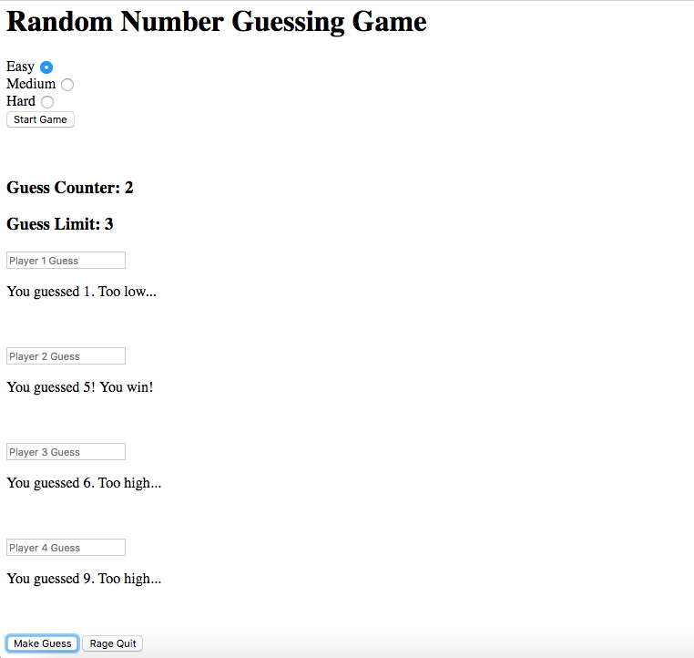

# Random Number Guessing Game
In Week 2 at Prime, a group assignment involved creating a guessing game for four players. A local server allows up to four players to log in and play the game by selecting a difficulty setting and making 3 guesses. A random number based on the difficulty setting is generated (easy: 1-10, Medium: 1-50, hard: 1-100) and compared to each players guess, and gives feedback based on how close their guess is. A "Rage Quit" button stops the game at any time.

##  Current Limitations
* When starting a new game, previous guesses and feedback remain in input boxes.
* No styling yet added.